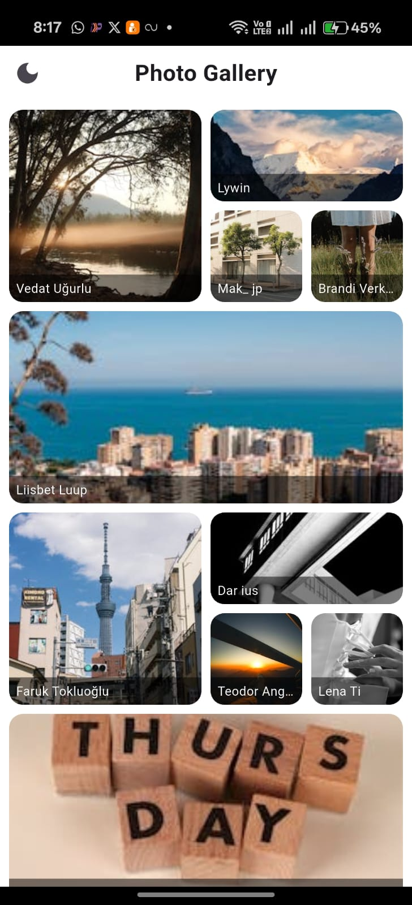
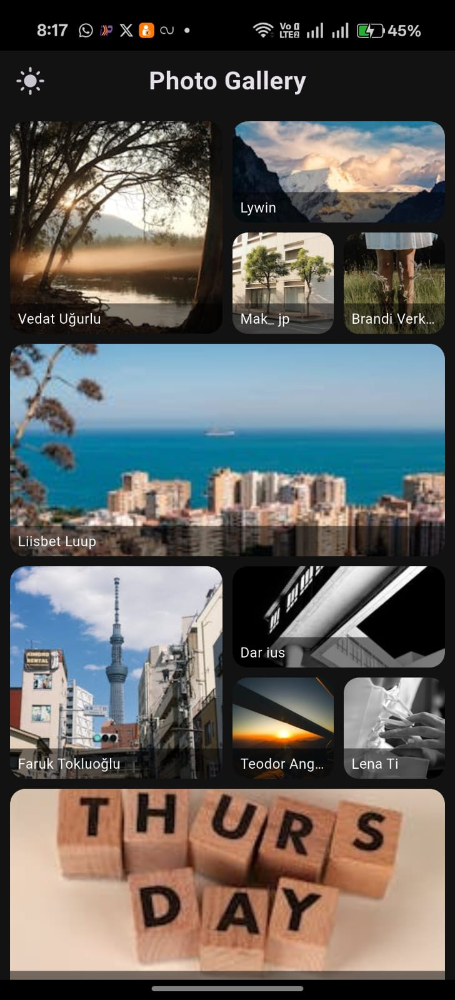
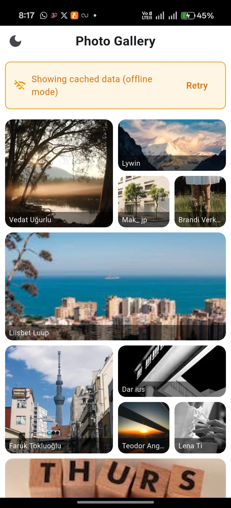

# 📸 Photo Gallery App

A modern Flutter application demonstrating Clean Architecture principles with a beautiful photo gallery interface. Built with offline-first approach, featuring stunning UI, efficient caching, and robust error handling.

## 🚀 Features

- **📱 Modern UI**: Beautiful staggered grid layout with smooth animations
- **🌐 API Integration**: Fetches high-quality photos from Pexels API
- **📴 Offline Support**: Works seamlessly without internet connection
- **🔄 Smart Caching**: Automatic image and data caching for better performance
- **🌙 Dark/Light Theme**: Dynamic theme switching with persistence
- **📄 Pagination**: Load more photos with smooth infinite scrolling
- **⚡ Fast Loading**: Optimized image loading with placeholders
- **🛡️ Error Handling**: User-friendly error messages and recovery options
- **📱 Responsive Design**: Works perfectly on all screen sizes
- **🎨 Clean Architecture**: Well-structured, maintainable codebase

## 📱 Screenshots

### Splash Screen

<br/>
*Native splash screen with app branding*

### Loading States

<br/>
*Smooth loading indicators and placeholders*

### Main Gallery View

<br/>
*Beautiful staggered grid layout with photo thumbnails*

### Dark Theme

<br/>
*Elegant dark mode with custom theming*

### Offline Light Mode

<br/>
*Seamless offline experience with cached data*

### Offline Dark Mode

<br/>
*Seamless offline experience with cached data*


## 🏗️ Clean Architecture Implementation

This project follows **Clean Architecture** principles, ensuring separation of concerns, testability, and maintainability. The architecture is divided into distinct layers with clear responsibilities and dependencies.

### Architecture Layers

```
┌─────────────────────────────────────────────────────────────┐
│                    PRESENTATION LAYER                       │
│  ┌─────────────────┐  ┌─────────────────┐  ┌──────────────┐ │
│  │   UI Widgets    │  │   State Mgmt    │  │   Pages      │ │
│  │                 │  │   (BLoC/Cubit)  │  │              │ │
│  │ • PhotoGrid     │  │ • PhotoCubit    │  │ • Home       │ │
│  │ • PhotoTile     │  │ • PhotoState    │  │              │ │
│  │ • AppHeader     │  │                 │  │              │ │
│  │ • OfflineBanner │  │                 │  │              │ │
│  └─────────────────┘  └─────────────────┘  └──────────────┘ │
└─────────────────────────────────────────────────────────────┘
                                │
                                ▼
┌─────────────────────────────────────────────────────────────┐
│                     DOMAIN LAYER                            │
│  ┌─────────────────┐  ┌─────────────────┐  ┌──────────────┐ │
│  │   Use Cases     │  │   Entities      │  │  Repository  │ │
│  │                 │  │                 │  │  Interface   │ │
│  │ • Load Photos   │  │ • PhotoModel    │  │ • DataRepo   │ │
│  │ • Cache Data    │  │ • ApiResponse   │  │              │ │
│  │ • Handle Errors │  │                 │  │              │ │
│  └─────────────────┘  └─────────────────┘  └──────────────┘ │
└─────────────────────────────────────────────────────────────┘
                                │
                                ▼
┌─────────────────────────────────────────────────────────────┐
│                      DATA LAYER                             │
│  ┌─────────────────┐  ┌─────────────────┐  ┌──────────────┐ │
│  │   Repository    │  │   Data Sources  │  │   Services   │ │
│  │  Implementation │  │                 │  │              │ │
│  │ • DataRepoImpl  │  │ • PexelsApi     │  │ • CacheSvc   │ │
│  │                 │  │ • Retrofit      │  │ • SharedPrefs│ │
│  │                 │  │ • Dio           │  │              │ │
│  └─────────────────┘  └─────────────────┘  └──────────────┘ │
└─────────────────────────────────────────────────────────────┘
```

### Layer Responsibilities

#### **🎨 Presentation Layer** (`lib/features/photo_gallery/presentation/`)
**Purpose**: Handle user interface and user interactions

**Components**:
- **Pages**: Main screens (`home.dart`)
- **Widgets**: Reusable UI components
  - `app_header.dart` - App title and theme toggle
  - `photo_content.dart` - Main content area
  - `photo_grid.dart` - Staggered grid layout
  - `photo_tile.dart` - Individual photo display
  - `offline_banner.dart` - Offline status indicator
  - `load_more_button.dart` - Pagination control
  - `loading_indicator.dart` - Loading states
  - `error_widget.dart` - Error display
- **State Management**: BLoC/Cubit pattern
  - `photo_cubit.dart` - Business logic for photo management
  - `photo_state.dart` - State definitions (Initial, Loading, Loaded, Error)

**Responsibilities**:
- Display UI based on state
- Handle user interactions
- Manage UI state transitions
- Provide user feedback

#### **🧠 Domain Layer** (Implicit through Cubit)
**Purpose**: Contains business logic and use cases

**Components**:
- **Use Cases**: Business operations
  - Load photos with pagination
  - Handle offline/online scenarios
  - Manage caching strategy
  - Error handling and recovery
- **Entities**: Core business objects
  - `PhotoModel` - Photo data structure
  - `ApiResponseModel` - API response wrapper
- **Repository Interface**: Data access contract
  - `DataRepo` - Abstract repository interface

**Responsibilities**:
- Define business rules
- Orchestrate data operations
- Handle application logic
- Manage state transitions

#### **💾 Data Layer** (`lib/features/photo_gallery/data/`)
**Purpose**: Handle data operations and external services

**Components**:
- **Repository Implementation**: `repo_impl.dart`
- **Data Sources**:
  - `pexels_api_service.dart` - API service implementation
  - `api_services.dart` - Retrofit interface
- **Models**: Data transfer objects
  - `photo_model.dart` - Photo entity with JSON serialization
  - `api_response_model.dart` - API response structure
- **Services**:
  - `cache_service.dart` - Local storage management

**Responsibilities**:
- Fetch data from external APIs
- Store and retrieve local data
- Handle data transformation
- Manage network operations

### Repository Pattern Implementation

The Repository Pattern provides an abstraction layer between the domain and data layers, ensuring loose coupling and testability.

```dart
// Repository Interface (Domain Layer)
abstract class DataRepo {
  Future<ApiResponseModel> getCuratedPhotos({int? page, int? perPage});
}

// Repository Implementation (Data Layer)
class DataRepoImpl implements DataRepo {
  final PexelsApiService pexelsApiService;
  final CacheService cacheService;

  @override
  Future<ApiResponseModel> getCuratedPhotos({int? page, int? perPage}) async {
    try {
      // 1. Try API first
      final response = await pexelsApiService.getCuratedPhotos(page: page, perPage: perPage);
      
      // 2. Cache successful responses
      if (response.photos != null && response.photos!.isNotEmpty) {
        await cacheService.cachePhotos(response.photos!);
      }
      
      return response;
    } catch (e) {
      // 3. Fallback to cached data
      final cachedPhotos = await cacheService.getCachedPhotos();
      if (cachedPhotos.isNotEmpty) {
        return ApiResponseModel(/* cached data */);
      }
      
      // 4. Throw user-friendly error
      throw Exception('User-friendly error message');
    }
  }
}
```

### Data Flow Architecture

```
┌─────────────────┐    ┌─────────────────┐    ┌─────────────────┐
│   UI Layer      │    │  Domain Layer   │    │   Data Layer    │
│                 │    │                 │    │                 │
│  Home Widget    │◄──►│  PhotoCubit     │◄──►│  DataRepo       │
│                 │    │                 │    │                 │
│  PhotoContent   │    │  PhotoState     │    │  PexelsApi      │
│                 │    │                 │    │                 │
│  PhotoGrid      │    │  Business       │    │  CacheService   │
│                 │    │  Logic          │    │                 │
└─────────────────┘    └─────────────────┘    └─────────────────┘
         │                       │                       │
         │                       │                       │
         ▼                       ▼                       ▼
┌─────────────────┐    ┌─────────────────┐    ┌─────────────────┐
│  State Updates  │    │  Use Cases      │    │  External APIs  │
│                 │    │                 │    │                 │
│  Loading        │    │  Pagination     │    │  Pexels API     │
│  Loaded         │    │  Caching        │    │  Local Storage  │
│  Error          │    │  Error Handling │    │  SharedPrefs    │
└─────────────────┘    └─────────────────┘    └─────────────────┘
```

### Detailed Data Flow

#### **1. Initial Load Flow**
```
User Opens App
       ↓
Home Widget initState()
       ↓
PhotoCubit.loadPhotos()
       ↓
DataRepo.getCuratedPhotos()
       ↓
PexelsApiService.getCuratedPhotos()
       ↓
API Call to Pexels
       ↓
Response Processing
       ↓
Cache Photos (if successful)
       ↓
Emit PhotoLoaded State
       ↓
UI Updates with Photos
```

#### **2. Pagination Flow**
```
User Clicks "Show More"
       ↓
PhotoCubit.loadMorePhotos()
       ↓
Emit LoadingMore State (keep existing photos)
       ↓
DataRepo.getCuratedPhotos(page: nextPage)
       ↓
API Call with Pagination
       ↓
Append New Photos to Existing List
       ↓
Emit PhotoLoaded State with All Photos
       ↓
UI Updates with Additional Photos
```

#### **3. Offline Fallback Flow**
```
API Call Fails
       ↓
Catch Exception in Repository
       ↓
Check CacheService.getCachedPhotos()
       ↓
If Cached Data Exists:
  Return Cached Data as ApiResponseModel
  ↓
Emit PhotoLoaded State with isOfflineData: true
       ↓
UI Shows Offline Banner + Cached Photos
```

#### **4. Error Handling Flow**
```
Error Occurs
       ↓
PexelsApiService throws user-friendly exception
       ↓
Repository catches and enhances error message
       ↓
PhotoCubit catches and checks for cached data
       ↓
If no cached data: Emit PhotoError State
       ↓
ErrorDisplayWidget shows user-friendly error UI
```

### Clean Architecture Principles Applied

#### **1. Dependency Inversion**
- **High-level modules** (UI, Cubit) don't depend on low-level modules (API, Database)
- **Abstractions** (DataRepo interface) are defined by high-level modules
- **Dependency Injection** using GetIt for loose coupling

#### **2. Single Responsibility**
- **PhotoCubit**: Manages photo state and business logic
- **DataRepo**: Handles data operations
- **PexelsApiService**: Manages API communication
- **CacheService**: Handles local storage
- **Widgets**: Each handles specific UI concerns

#### **3. Open/Closed Principle**
- **Extensible**: New data sources can be added without modifying existing code
- **Repository Pattern**: Allows switching between different data sources
- **Widget Composition**: New UI components can be added easily

#### **4. Interface Segregation**
- **Focused Interfaces**: DataRepo has only photo-related methods
- **Specific Contracts**: Each service has a clear, focused responsibility

#### **5. Dependency Rule**
```
UI Layer → Domain Layer → Data Layer
    ↑           ↑           ↑
  Depends    Depends    Depends
    on          on        on
  Domain     Data       External
  Layer      Layer      Services
```

## 🛠️ Technology Stack

- **Framework**: Flutter 3.7+
- **State Management**: flutter_bloc (Cubit)
- **Network**: Dio + Retrofit
- **Dependency Injection**: GetIt
- **Local Storage**: SharedPreferences
- **Image Caching**: cached_network_image
- **UI Components**: flutter_staggered_grid_view
- **Code Generation**: json_serializable, retrofit_generator
- **Splash Screen**: flutter_native_splash

## 📦 Dependencies

```yaml
dependencies:
  flutter:
    sdk: flutter
  dio: ^5.8.0+1
  retrofit: ^4.6.0
  get_it: ^8.0.3
  json_annotation: ^4.9.0
  flutter_bloc: ^9.1.1
  flutter_staggered_grid_view: ^0.7.0
  shared_preferences: ^2.2.2
  provider: ^6.1.1
  cached_network_image: ^3.3.1

dev_dependencies:
  flutter_test:
    sdk: flutter
  flutter_lints: ^5.0.0
  json_serializable: ^6.9.5
  build_runner: ^2.5.4
  flutter_native_splash: ^2.4.0
```

## 🚀 Project Setup & Installation

### Prerequisites

- **Flutter SDK**: 3.7.0 or higher
- **Dart SDK**: 3.0.0 or higher
- **IDE**: Android Studio / VS Code with Flutter extensions
- **Git**: For version control
- **Android Studio / Xcode**: For platform-specific development

### Step-by-Step Installation

#### **1. Clone the Repository**
```bash
git clone https://github.com/yourusername/photo-gallery.git
cd photo-gallery
```

#### **2. Install Flutter Dependencies**
```bash
flutter pub get
```

#### **3. Generate Code Files**
This step is **CRITICAL** for the app to work properly. The project uses code generation for:
- JSON serialization (`PhotoModel`, `ApiResponseModel`)
- Retrofit API client (`ApiServices`)

```bash
flutter packages pub run build_runner build
```

**Note**: If you encounter conflicts, use:
```bash
flutter packages pub run build_runner build --delete-conflicting-outputs
```

#### **4. Generate Splash Screen Assets**
```bash
dart run flutter_native_splash:create
```

#### **5. Run the Application**

**For Development:**
```bash
flutter run
```

**For Specific Platform:**
```bash
# Android
flutter run -d android

# iOS
flutter run -d ios

# Web
flutter run -d chrome
```

### Build for Production

#### **Android Build**
```bash
# Generate APK
flutter build apk --release

# Generate App Bundle (recommended for Play Store)
flutter build appbundle --release
```

#### **iOS Build**
```bash
flutter build ios --release
```

## 🔧 Configuration

### API Key Setup

The app uses the Pexels API for fetching photos. The API key is already configured, but you can replace it with your own:

1. **Get API Key**: Visit [Pexels API](https://www.pexels.com/api/) and sign up
2. **Update Key**: Replace the key in `lib/features/photo_gallery/data/data_source/pexels_api_service.dart`:
   ```dart
   static const String _apiKey = 'YOUR_API_KEY_HERE';
   ```

### Splash Screen Customization

Edit `flutter_native_splash.yaml` to customize the splash screen:

```yaml
flutter_native_splash:
  color: "#ffffff"
  image: assets/white_splash.png
  android_12:
    image: assets/white_splash.png
    color: "#ffffff"
```

Then regenerate:
```bash
dart run flutter_native_splash:create
```

### Theme Customization

Modify `lib/core/theme/app_theme.dart` to customize:
- Primary colors
- Background colors
- Text styles
- Component themes

## 📊 Performance Features

- **Image Optimization**: Automatic resizing and caching
- **Memory Management**: Efficient image loading with size limits
- **Network Optimization**: Request caching and retry logic
- **UI Performance**: Optimized widget rebuilds with BLoC

## 🔒 Error Handling

The app implements comprehensive error handling:

- **Network Errors**: Graceful fallback to cached data
- **API Errors**: User-friendly error messages
- **Image Loading**: Placeholder and error states
- **Offline Mode**: Seamless offline experience

## 🎨 UI/UX Features

- **Staggered Grid**: Beautiful photo layout
- **Smooth Animations**: Loading and transition effects
- **Responsive Design**: Adapts to all screen sizes
- **Accessibility**: Screen reader support
- **Theme Switching**: Dynamic light/dark mode

## 🤝 Contributing

1. Fork the repository
2. Create your feature branch (`git checkout -b feature/AmazingFeature`)
3. Commit your changes (`git commit -m 'Add some AmazingFeature'`)
4. Push to the branch (`git push origin feature/AmazingFeature`)
5. Open a Pull Request

## 📝 License

This project is licensed under the MIT License - see the [LICENSE](LICENSE) file for details.

## 🙏 Acknowledgments

- [Pexels API](https://www.pexels.com/api/) for providing high-quality photos
- [Flutter Team](https://flutter.dev/) for the amazing framework
- [flutter_bloc](https://bloclibrary.dev/) for state management
- [Retrofit](https://pub.dev/packages/retrofit) for API client generation

## 📞 Contact

- **Developer**: [Your Name]
- **Email**: [your.email@example.com]
- **LinkedIn**: [Your LinkedIn]
- **GitHub**: [@yourusername]

---

⭐ **Star this repository if you found it helpful!**

---

*Built with ❤️ using Flutter and Clean Architecture principles*
